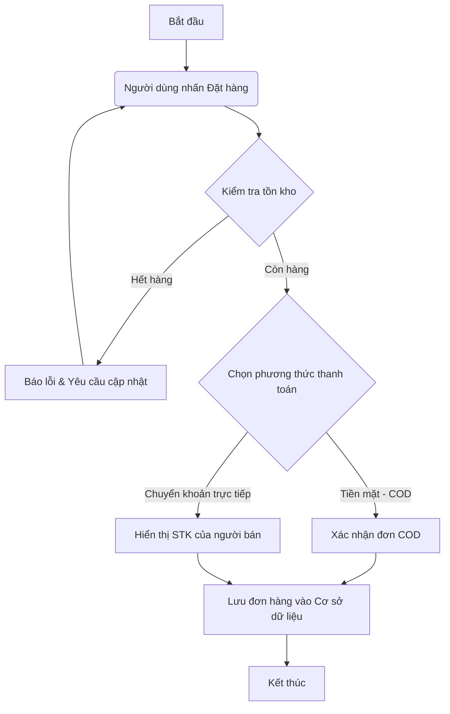
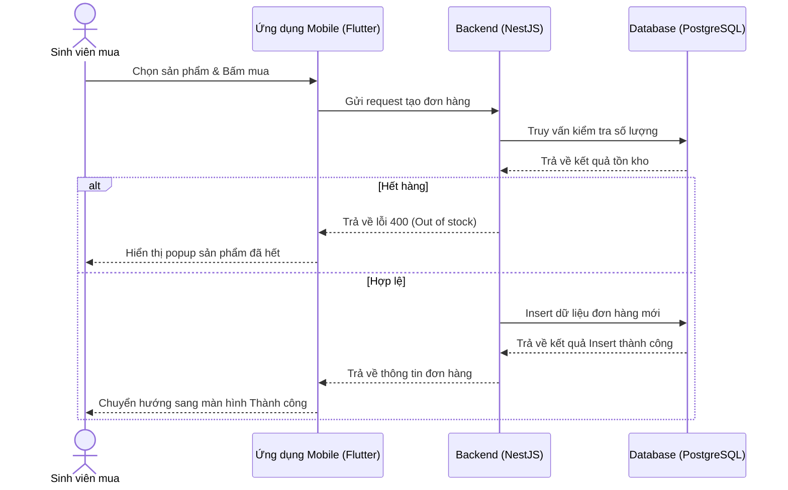
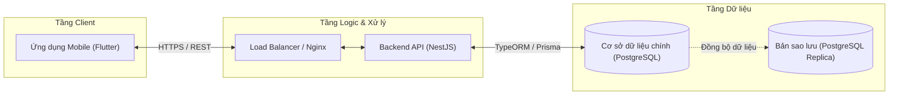
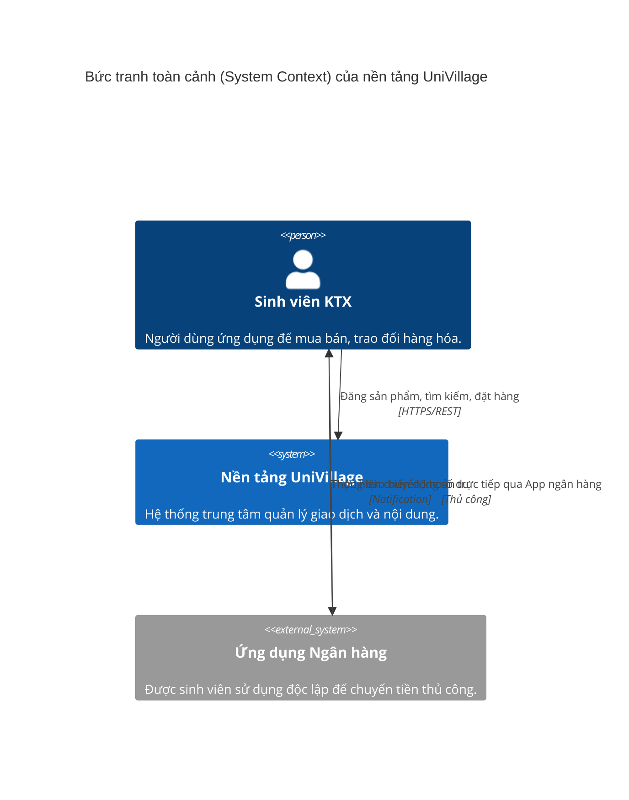

# BÀI TẬP TÌM HIỂU VÀ SỬ DỤNG MERMAID.LIVE
- **Học phần:** Kiến trúc Phần mềm / Nhập môn Công nghệ Phần mềm
- **Chủ đề thực hành:** Quy trình đặt hàng và thanh toán trực tiếp (No E-Wallet) - Dự án UniVillage

---

### 1. Flowchart (Mô tả thuật toán đặt hàng và kiểm tra tồn kho)
Biểu đồ này mô tả thuật toán kiểm tra số lượng sản phẩm trong kho và hướng dẫn người dùng phương thức thanh toán không qua ví điện tử.

---

### 2. Sequence Diagram (Mô tả thứ tự thực hiện công việc tạo đơn hàng)
Biểu đồ thể hiện trình tự giao tiếp giữa các thành phần trong hệ thống khi có luồng công việc đặt mua sản phẩm.

---

### 3. Architecture (Mô tả kiến trúc hệ thống tổng thể)
Sơ đồ phân rã kiến trúc 3 tầng của ứng dụng UniVillage.

---

### 4. C4 Model (Mô tả Context - Bối cảnh hệ thống cấp độ 1)
Mô tả mối quan hệ giữa Sinh viên, Nền tảng UniVillage và Ứng dụng ngân hàng bên ngoài.

